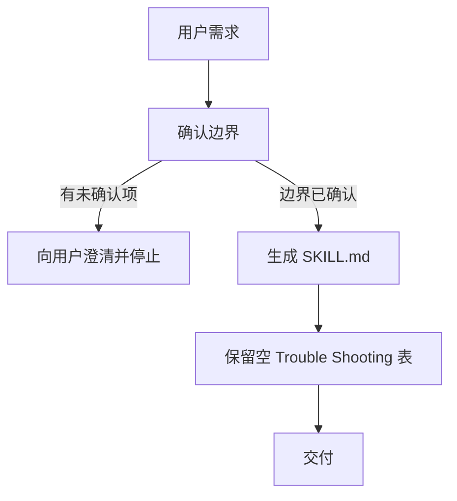

# 创建 Dry Skill

## 整体思路

给智能体的限制越多，思路越封闭，效果可能越差。因此只在真实遇到问题时才增加规则，不预先增加无根据的限制。本技能生成 dry skill 时，正文只承载用户已确认且能在具体场景中执行的边界。

## 目的与适用范围

本技能只在用户明确要新建一个 skill 时使用。它生成一个**最小可执行**的 `SKILL.md`：目录默认只有该文件本身，正文只承载用户已表达且能在具体场景中执行的边界；凡用户未提出、未验证的安全、权限、质量或“未来可能有用”的要求，一律不进入正文。

最终产物是 `SKILL.md` 与（仅在确有长资料需求时的）`references/`；不产出讨论记录、删改历史、内部推理或验收过程。

## Rules

1. 只消费用户原话和具体场景，生成前必须确认触发条件、输入、处理范围、输出和用户明确排除项。推断出的候选边界一律标为“待确认”，未确认前不写入正文。
2. `SKILL.md` 只包含：已确认范围、整体思路、可执行规则、实际流程、（可选的）Mermaid 图、留空的 Trouble Shooting 表格。不包含讨论问题、候选措辞、删改历史、拒绝理由或空泛口号。
3. 默认只创建 `SKILL.md` 一个文件；仅当正文确实需要较长、按需读取的材料时才增加 `references/`，不为“完整”预建目录。
4. Trouble Shooting 初始只有表头，无数据行。之后只追加真实发生、可复现的违反场景，不预填猜想问题，也不把一般建议伪装成事故。
5. `references/` 仅作为相对路径/URL 的资源指引，由智能体按需读取；不枚举目录。
6. Mermaid 是可选但推荐的：流程性 skill 通常需要它，知识性 skill 可以不画；画时须表达可观察的输入、决策、停点、处理和输出，不是装饰，也不画内部推理、删改历史或拒绝理由。

## Process

1. **讨论并确定边界**：以用户原话和具体场景为输入。通过提问确认触发条件、输入、处理范围、输出和用户明确排除项；输出一份短的“已确认边界”清单。所有推断出的候选限制标为“待确认”，未确认前不得进入下一步。
2. **整理成 skill**：只消费已确认清单，生成可加载的 `SKILL.md`、（可选）Mermaid 流程图、可执行规则和明确非目标。正文骨架与输出模板见“生成模板”。讨论问题、候选措辞、删改历史和内部推理不属于交付物。
3. **Trouble Shooting**：初始只保留空模板（表头 + 无数据行）。有真实违反场景时再追加，并附可复现证据。

### 生成模板

以四反引号包裹外层代码块，以便在模板内嵌套 mermaid 与 markdown 代码块：

````markdown
---
name: <kebab-case-name>
description: <一句话说明触发场景和结果>
---

# <标题>

## 整体思路
<!-- 用一句话说明整体设计立场。例如 dry-skill：给智能体的限制越多，思路越封闭，效果可能越差；因此只在真实遇到问题时才增加规则，不预先增加无根据的限制。 -->

## 目的与适用范围
<!-- 只写已确认的场景、输入、输出和范围。 -->

## Rules
<!-- 每条规则都能回指用户语句；只写可执行的 MUST/NEVER。 -->

## Process
<!-- 触发、处理、交付；不写模型思考或工作日志。 -->

## Mermaid 流程（可选，推荐）
<!-- 流程性 skill 通常需要；知识性 skill 可不画，但推荐画，人和智能体都更清晰。 -->


## Trouble Shooting

只有当真实工作中智能体不符合预期时，才把新增的规则及原因记录在这里；每行都应能回溯到出现的问题。随着后续使用不断补充。若某条规则所针对的场景未来不再失败（例如模型能力提升后不再犯），应删掉该规则，避免 skill 随使用变长而弱化智能体能力。

| 序号 | 规则 | 违反该规则时的场景 |
|---:|---|---|

## Non-goals / Limits
<!-- 仅写用户明确排除的事项；没有就不扩写。 -->
````

## Mermaid 流程（可选，推荐）

流程性 skill 通常需要；知识性 skill 可不画，但推荐画，人和智能体都更清晰。


## Trouble Shooting

只有当真实工作中智能体不符合预期时，才把新增的规则及原因记录在这里；每行都应能回溯到出现的问题。随着后续使用不断补充。若某条规则所针对的场景未来不再失败（例如模型能力提升后不再犯），应删掉该规则，避免 skill 随使用变长而弱化智能体能力。

| 序号 | 规则 | 违反该规则时的场景 |
|---:|---|---|

## Non-goals / Limits

- 不实现或暗示 Harness 层面强制委派、reference 访问控制或根智能体不可绕过的隔离。
- 不因追求“完整”引入额外流程、门槛、配置或维护账本。
- 三角色委派、额外 references 和质量门槛是否值得增加，须由真实试用中的问题证明；当前方案不预设这些能力。
