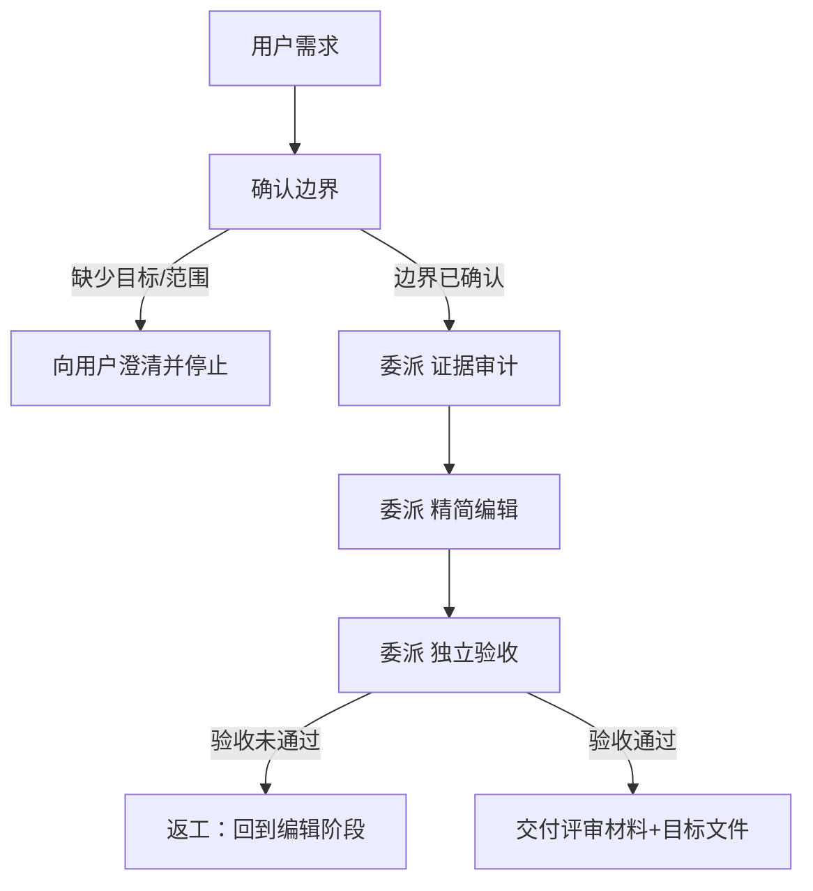

# 精简技能

## 整体思路

给智能体的限制越多，思路越封闭，效果可能越差。因此只在真实遇到问题时才增加规则，不预先增加无根据的限制。本技能对已有 skill 做证据驱动的精简：只保留有证据支撑的约束，删除或迁移推测性边界、重复事实、过程叙事和作者会话残留。这不是一次删减，而是一次判断——按证据决定保留、迁移、压缩或删除。

## 目的与适用范围

本技能只在用户明确要精简一个已有 skill（或 standing instruction）时使用。它以证据为唯一依据：不以字数、语气或“像 AI 写的”作为单独判断点，只保留有生产证据、明确 owner、真实安全/权限/持久化/生命周期/兼容性要求的约束。

它围绕一个既有的目标文件工作，产出三份独立判断（证据审计、精简编辑、独立验收），由三个角色通过子会话完成；根智能体只负责编排和按验收结果决定接受或返工。

最终产物是被精简的目标文件本身，外加一份规则—owner—证据表（供评审，不写回目标文件）。不产出讨论记录、删改历史、内部推理或逐步思考摘录。

## 规则

1. 只消费用户原话和具体场景，动手前必须先确认目标路径、处理范围（目标文件 + 哪些相邻文件）和用户明确排除项。所有推断出的编辑候选标为“待确认”，未确认前不写入目标文件。
2. 以证据决定保留、迁移、压缩或删除，不以篇幅、语气或“AI 味”作为单独依据。每处判断都要能回指一条用户语句、一处生产调用、一个 owner 或一份真实约束。
3. 安全、权限、持久化、生命周期、兼容性和故障恢复约束是高风险项：默认保留，仍须确认它描述的是当前机制而非假设。
4. 三阶段（证据审计、精简编辑、独立验收）由三个独立子智能体执行；审计者只读，编辑者只改明确目标，验收者只读 diff 和必要 owner。若运行环境没有子智能体能力，明确报告缺失并停止，不在根上下文中“模拟委派”。
5. 前一阶段只传结构化事实，不传自由形式思考记录。建议字段为 `target`、`classification`、`owner`、`evidence`、`risk`、`action`。
6. 问题排查初始只有表头，无数据行。之后只追加真实发生、可复现的违反场景，不预填猜想问题。
7. Mermaid 是可选但推荐的：流程性 skill 通常需要它，知识性 skill 可以不画；画时须表达可观察的输入、决策、停点、处理和输出，不是装饰。

## 流程

1. **确认边界**：确认目标文件路径、处理范围、排除项，以及是否只读还是允许修改。
2. **证据审计**：委派子智能体读取 `references/evidence-audit.md`，列出目标规则的范围（scope）、owner、生产证据、违反后果和建议处置；只读，不得编辑。产出结构化结论。
3. **精简编辑**：委派子智能体读取 `references/prose-audit.md` 和证据审计结论，修改目标文件；不得扩大审计范围，不得写入讨论过程。产出编辑 diff。
4. **独立验收**：委派子智能体读取 `references/acceptance.md`，检查 diff、引用、遗漏的真实边界和仓库门禁；验收者不得复用编辑者。产出验收结论。
5. **决定接受或返工**：根智能体根据验收结果决定接受或返工。根不复述 reference 内容，不把子智能体的分析全文写入目标或最终报告。
6. **交付评审材料**：输出一份规则—owner—证据表（不写回目标文件），说明保留了哪些、迁移/压缩/删除了哪些及证据。

## Mermaid 流程（可选，推荐）

## 问题排查

只有当真实工作中智能体不符合预期时，才把新增的规则及原因记录在这里；每行都应能回溯到出现的问题。随着后续使用不断补充。若某条规则所针对的场景未来不再失败（例如模型能力提升后不再犯），应删掉该规则，避免 skill 随使用变长而弱化智能体能力。

| 序号 | 规则 | 违反该规则时的场景 |
|---:|---|---|

## 非目标与限制

- 不把 `references/` 宣称为安全隔离、权限边界或保密存储；不保证根智能体无法直接读取 reference 或绕过委派。
- 不追求最短文本，不删除仅仅“很长”但确有生产证据的规则。
- 不把风格偏好提升为安全规则，也不自动把所有细节迁入 reference。
- 不通过新增一套复杂分类、配置项或长期维护的审计账本来替代判断。
- 不实现或暗示 Harness 层面强制委派、reference 访问控制或根智能体不可绕过的隔离。
